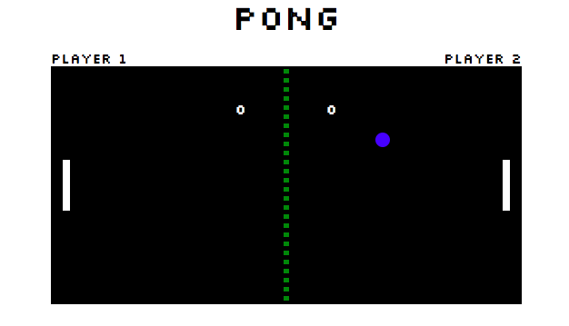

# Pong Game

A basic pong game using SVGs. TO sucessfully see the game with all correct positions please clone the repo, and open the game with webpack.

# Pong after someone scores a goal:

# Pong after we have a winner.

## Setup

**Install dependencies:**

`> npm i`

**Run locally with Webpack Dev Server:**

`> npm start`

**Build for production:**

`> npm run build`

## Keys

**Player 1:**
* a: up
* z: down

**Player 2:**
* ▲ : up
* ▼: down
